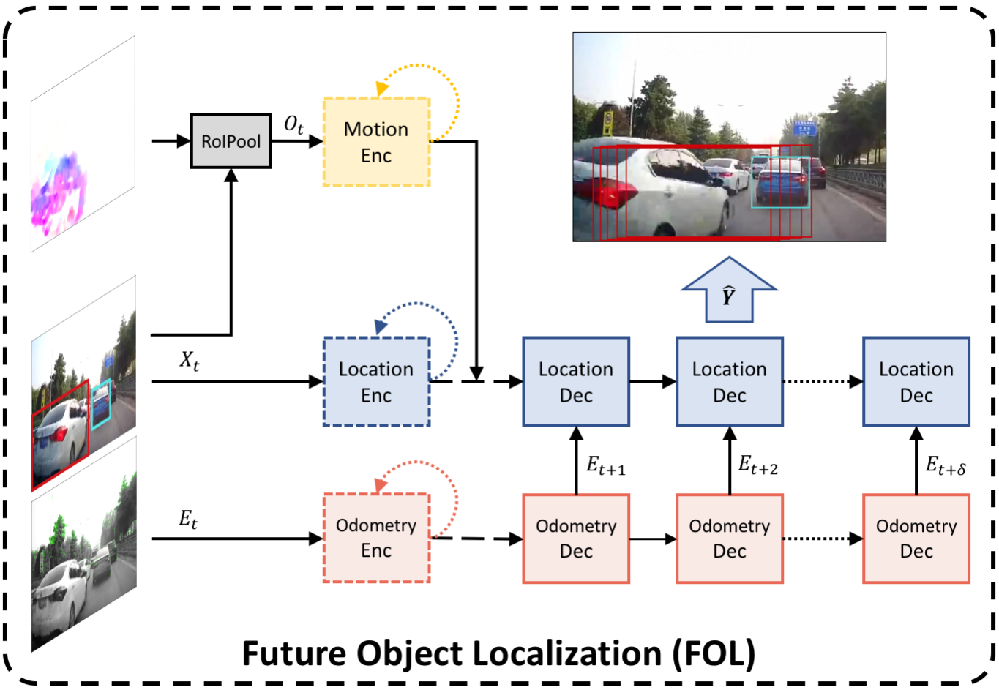

# Unsupervised Traffic Accident Detection in First-Person Videos

_Yu Yao*, Mingze Xu*, Yuchen Wang, David Crandall and Ella Atkins_

## Updates

:boom: **May 19th 2020**: [Our new Detection of Traffic Anomaly (DoTA) dataset is available here](https://github.com/MoonBlvd/Detection-of-Traffic-Anomaly)! DoTA can be considered an extention of A3D which provides more videos (4677 raw videos!) and annotations (anomaly type, anomaly objects, and track ids). 

DoTA provides more benchmarks for driving video anomaly detection, action recognition and online action detection. The corresponding paper can be found [here](https://arxiv.org/pdf/2004.03044.pdf). 

## Introduction to this repo
This repo contains A3D dataset and the code for our [IROS2019 paper](https://arxiv.org/pdf/1903.00618.pdf) on unsupervised traffic accident detection.

This code also contains a improved pytorch implementation of our ICRA paper [*Egocentric Vision-based Future Vehicle Localization for Intelligent Driving Assistance Systems*](https://arxiv.org/pdf/1809.07408.pdf), which is an important building block for the traffic accident detection. The original project repo is https://github.com/MoonBlvd/fvl-ICRA2019


## Requirements
To run the code on feature-ready HEV-I dataset or dataset prepared in HEV-I style:

	cuda9.0 or newer
	pytorch 1.0
	torchsummaryX
	tensorboardX
## Train and test
Note that we apply a FOL and ego-motion prediction model to do unsupervised anomaly detection. Thus model training is to train the FOL and ego-motion prediction model on normal driving dataset. We haved used HEV-I as the training set.
### Train
The training script and a config file template are provided. We trained the ego motion predictor first and then train the FOL and ego motion predictor jointly:

	python train_ego_pred.py --load_config config/fol_ego_train.yaml
	python train_fol.py --load_config config/fol_ego_train.yaml

### Run FOL on test set and then Anomaly Detection
For evaluation purpose, we firstly run our fol_ego model on test dataset, e.g. A3D to generate all predictions

	python run_fol_for_AD.py --load_config config/test_A3D.yaml

This will save one ```.pkl``` file for each video clip. Then we can use the saved predictions to calculate anomaly detection metrics. The following command will print results similar to the paper.

	python run_AD.py --load_config config/test_A3D.yaml

The online anomaly detection script is not provided, but the users are free to write another script to do FOL and anomaly detection online. 

## Dataset and features
## A3D dataset
The A3D dataset contains videos from YouTube and a ```.pkl``` file including human annotated video start/end time and anomaly start/end time. We provide scripts and url files to download the videos and run pre-process to get the same images we haved used in the paper.

Download the videos from YouTube:

	python datasets/A3D_download.py --download_dir VIDEO_DIR --url_file datasets/A3D_urls.txt

Then convert the videos to images in 10Hz

	python scripts/video2frames.py -v VIDEO_DIR -f 10 -o IMAGE_DIR -e jpg

Note that each downloaded video is a combination of several short clips, to split them into clips we used, run:

	python datasets/A3D_split.py --root_dir DATA_ROOT --label_dir DIR_TO_PKL_LABEL

The annotations can be found in ```datasets/A3D_labels.pkl``` 

### HEV-I dataset
[Honda Egocentric View-Intersection (HEV-I)](https://usa.honda-ri.com/hevi) dataset is owned by HRI and the users can follow the link to request the dataset.

However, we provide the newly generated features here in case you are interested in just using the input features to test your models:

[Training features](https://drive.google.com/open?id=1TE-smXm4dD2QgoCQHYmzLHqSsltoIxbe)

[Validation features](https://drive.google.com/open?id=1Vcu6NU7PwDOPTv6RU_7AuBfj6I0rj4dR)

Each feature file is name as "*VideoName*_*ObjectID*.pkl". Each .pkl file includes 4 attributes:.
* frame_id: the temporal location of the object in the video;
* bbox: the bounding box of the object from it appears to it disappears;
* flow: the corresponding optical flow features of the object obtained from the ROIPool;
* ego_motion: the corresponding [yaw, x, z] value of ego car odometry obtained from the orbslam2.


To prepare the features used in this work, we used:
* Detection: [MaskRCNN](https://github.com/MoonBlvd/Mask_RCNN)
* Tracking: [DeepSort](https://github.com/nwojke/deep_sort)
* Dense optical flow: [FlowNet2.0](https://github.com/NVIDIA/flownet2-pytorch)
* Ego motion: [ORBSLAM2](https://github.com/raulmur/ORB_SLAM2)


## Future Object Localization



To train the model, run:

	python train_fol.py --load_config YOUR_CONFIG_FILE

To test the model, run:

	python test_fol.py --load_config YOUR_CONFIG_FILE
 
 An example of the config file can be found in ```config/fol_ego_train.yaml```

### Evaluation results on HEV-I dataset
We do not slipt the dataset into easy and challenge cases as we did in the original repo. Instead we evalute all cases together. We are still updating the following results table by changing the prediction horizon and the ablation models.

|     Model      | train seg length | pred horizon | FDE  | ADE  | FIOU |
| :------------: | ---------------- | ------------ | ---- | ---- | ---- |
| FOL + Ego pred | 1.6 sec          | 0.5 sec      | 11.0 | 6.7  | 0.85 |
| FOL + Ego pred | 1.6 sec          | 1.0 sec      | 24.7 | 12.6 | 0.73 |
| FOL + Ego pred | 1.6 sec          | 1.5 sec      | 44.1 | 20.4 | 0.61 |
| FOL + Ego pred | 3.2 sec          | 2.0 sec      | N/A  | N/A  | N/A  |
| FOL + Ego pred | 3.2 sec          | 2.5 sec      | N/A  | N/A  | N/A  |

**Note**: Due to the change of model structure, the above evaluation results can be different from the original paper. The users are encouraged to compare with the result listed in this repo since the new model structure is more efficient than the model proposed in the original paper.

### Traffic Accident Detection Demo


## Citation
If you found the repo is useful, please feel free to cite our papers:

	@inproceedings{yao2018egocentric,
		title={Egocentric Vision-based Future Vehicle Localization for Intelligent Driving Assistance Systems},
		author={Yao, Yu and Xu, Mingze and Choi, Chiho and Crandall, David J and Atkins, Ella M and Dariush, Behzad},
		journal={IEEE International Conference on Robotics and Automation (ICRA)},
		year={2019}
	}

	@inproceedings{yao2019unsupervised,
		title={Unsupervised Traffic Accident Detection in First-Person Videos},
		author={Yao, Yu and Xu, Mingze and Wang, Yuchen and Crandall, David J and Atkins, Ella M},
		journal={IEEE/RSJ International Conference on Intelligent Robots and Systems (IROS)},
		year={2019}
	}
	
<!-- ## Run detection
Go to Mask-RCNN root directory run:

	python run_inference.py \
        -i /media/DATA/VAD_datasets/taiwan_sa/testing/frames \
        -o /media/DATA/VAD_datasets/taiwan_sa/testing/mask_rcnn_detections \
        --for_deepsort \
        --image_shape 1280 720 3 \
        -g=0

## Run tracking
Go to deep-sort root directory run:

	python deep_sort_app.py \
    --sequence_dir=/media/DATA/VAD_datasets/taiwan_sa/testing/frames \
    --detection_dir=/media/DATA/VAD_datasets/taiwan_sa/testing/mask_rcnn_detections \
    --min_confidence=0.3 \
    --nms_max_overlap=0.5 \
    --output_dir=/media/DATA/VAD_datasets/taiwan_sa/testing/deep_sort:w

## Run flownet2
Go to flownet2 root directory run:

	export CUDA_VISIBLE_DEVICES=0
	python main.py \
	    --skip_validation \
	    --skip_train \
	    --inference \
	    --no_loss \
	    --save_flow \
	    --model FlowNet2 \
	    --inference_dataset TaiwanSA \
	    --inference_dataset_root data/taiwan_sa/testing \
	    --inference_size 320 192 \
	    --resume checkpoints/FlowNet2_checkpoint.pth.tar

## Run ORB-SLAM2 for ego motion
Go to orb_slam2 root directory run:
	
	python rgb2gray.py --help
	
to make sure there is a 'time.txt' file in each video's folder. Make sure the time length is greather than or equal to the video length(!!)

Then run

	python run_all_videos.py --help

to generate odometry outputs. -->


<!-- ## Train ego motion prediction

1. Run scripts/odo_to_ego_motion.py to convert the ```.txt``` odometry files to ```.npy``` files containing yaw, xhttps://github.com/NVIDIA/flownet2-pytorch, z. Note that trainingtensorboardXand validation data are separately createdhttps://github.com/NVIDIA/flownet2-pytorch
2. Run ```python train_https://github.com/NVIDIA/flownet2-pytorchego_pred.py``` to traintensorboardXa RNN-ED ego motion prediction model.
https://github.com/NVIDIA/flownet2-pytorch
## Train FVL + ego motihttps://github.com/NVIDIA/flownet2-pytorchon preditcion
https://github.com/NVIDIA/flownet2-pytorch
1. Make sure ego motionhttps://github.com/NVIDIA/flownet2-pytorch model has been pretrained
2. In config/fvl_config.yaml indicate the best checkpoint of the ego motion prediction model
3. run  ```python train.py``` to train the FVL-ego model -->
